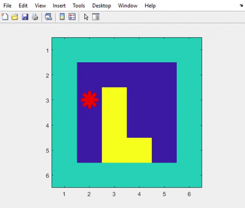
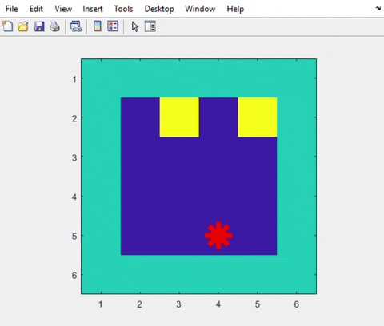

# Inteligência Artificial - Atividade 01 Complemento Trabalho 02

Fundação da Universidade Regional de Blumenau

Alunos: 
* Francisco Lucas Sens
* William Lopes da Silva


## Como funciona?

-------- Deixo aqui um modo para gerar o ambiente no python:------

``` python
import matplotlib.pyplot as plt

# Neste caso o robo começa na posição [1][1]
currLine = 1
currCol = 1

def exibir(matriz):
plt.imshow(matriz, 'gray')
plt.show(block=False)
plt.plot(currCol, currLine, '*r', 'LineWidth', 5)
plt.pause(0.5)
plt.clf()
```

porém funciona apenas em ambientes onde a biblioteca matplotlib esteja instalada.

## Descrição

Nas últimas aulas estudamos que os agentes interagem com o ambiente através dos sensores e
atuadores onde os sinais adquiridos pelos sensores formam as percepções do agente. Também
vimos os diferentes tipos de agentes, que se caracterizam em função da sua estrutura interna e da
presença de uma medida de desempenho, como Agentes Reativos Simples; Agentes Reativos
Baseados em Modelos; Agentes Baseados em Objetivos; Agentes Baseados na Utilidade; e Agentes
com Aprendizagem.

Este exercício discute as etapas de implementação de um agente aspirador de pó automático
simples em um ambiente quadrado 4 x 4. 

## Questão 01:
Escreva uma função de Agente Reativo Simples para o mundo 4 x 4 do aspirador de pó
automático que garante limpar toda a sala, independentemente da posição inicial. A função
deve ser chamada **agenteReativoSimples(percepcao)** e deve retornar uma das 5 possíveis ações
('acima', 'abaixo', 'esquerda', 'direita', 'aspirar'). A variável "percepcao" dentro dos parênteses é
a entrada da função.
***Dicas:***
- Você pode considerar criar uma função de mapeamento (funcaoMapear) como um ponto de
partida.
- Tenha em mente que as ações contra a parede (por exemplo, mover para a esquerda
quando já está posicionado no ponto (1, 1)) não têm nenhum efeito (isto não significa que
são proibidas)

**Responda**: A sua solução é extensível para um mundo 3 x 3? E para um mundo 6 x 6? Explique sua
resposta.

**Como o agente reativo simples funciona:**



COMO FICA O AMBIENTE NA MATRIZ 6x6 (exemplo):
```
1 1 1 1 1 1
1 0 0 0 0 1
1 2 0 0 0 1
1 0 0 0 0 1
1 0 0 2 2 1
1 1 1 1 1 1
```

- Onde 1 é a parede (verde), 0 é onde está limpo (azul) e 2 é onde está sujo (amarelo)

- O agente baseado em objetivo quando limpa toda a sala ele para (NoOp)

## Questão 02:
A partir da estrutura do Agente Reativo Simples, aumente o código para transformá-lo em
Agentes Baseados em Objetivos, na qual:

- o agente tem que limpar toda a sala (função objetivo)
- o agente começa a partir quadrado (1, 1)

Utilize também uma variável de contador (chamada pontos) que contém o número de passos que o
agente leva até atingir o objetivo.

***Dicas:***
- Escreva uma função de verificação (checkObj(sala)) fora do programa agente que verifica se
há sujeira na sala (retorna 1 se tem sujeira, caso contrário retorna 0).
- Acrescente a ação "NoOp" na lista de ações do agente e ajuste a ação para "NoOp" uma vez
que a sala estiver limpa.

A função de agente deve ser chamado **agenteObjetivo(percepcao, objObtido)** e deve retornar uma
das 6 ações possíveis (5 inicialmente definidas + "NoOp"). O parâmetro objObtido é a saída da
função **checkObj(sala)**.

**Responda:** É possível ter todo o espaço limpo efetivamente? Justifique sua resposta.

**Como o agente baseado em objetivo funciona:**



- Lembre-se de fazer  a contagem de pontos e cada ação (inclusive aspirar conta ponto). Por exemplo: 

```
Estado da percepcao: 0 Acao escolhida: abaixo
Estado da percepcao: 0 Acao escolhida: esquerda
Estado da percepcao: 0 Acao escolhida: direita
Estado da percepcao: 1 Acao escolhida: aspirar
Estado da percepcao: 0 Acao escolhida: acima
Estado da percepcao: 0 Acao escolhida: esquerda
Estado da percepcao: 0 Acao escolhida: abaixo
Estado da percepcao: 0 Acao escolhida: abaixo
Estado da percepcao: 0 Acao escolhida: abaixo
Estado da percepcao: 1 Acao escolhida: aspirar
Estado da percepcao: 0 Acao escolhida: direita
Estado da percepcao: 0 Acao escolhida: direita
Estado da percepcao: 0 Acao escolhida: acima
Estado da percepcao: 0 Acao escolhida: direita
Estado da percepcao: 0 Acao escolhida: acima
Estado da percepcao: 0 Acao escolhida: direita
Estado da percepcao: 0 Acao escolhida: direita
Estado da percepcao: 0 Acao escolhida: abaixo
Estado da percepcao: 0 Acao escolhida: esquerda
Estado da percepcao: 0 Acao escolhida: abaixo
Estado da percepcao: 0 Acao escolhida: direita
Estado da percepcao: 1 Acao escolhida: aspirar
Ponto: -> 22
```

- Para esse agente você decide como ele vai se movimentar, lembrando que ele consegue enxergar todo o ambiente.

- Por último, lembre-se que o aspirador não pode voar :)

## Observações Importantes:

- Você deve trabalhar com a Matriz 6X6 (o ambiente é o espaço 4X4 e o restante são paredes). O ambiente gráfico é só para visualização;

- A sujeira (tanto a quantidade como a posição) é disposta aleatoriamente. 

- Lembre que o agente reativo simples funciona com ação-reação e não vai parar quando limpa todo o ambiente.

- Para o agente reativo simples você pode fazer um caminho onde o agente percorre todo o ambiente.

- Somente 1 pessoa da dupla precisa enviar o arquivo com nome: "APA_nome1_Nome2.zip"